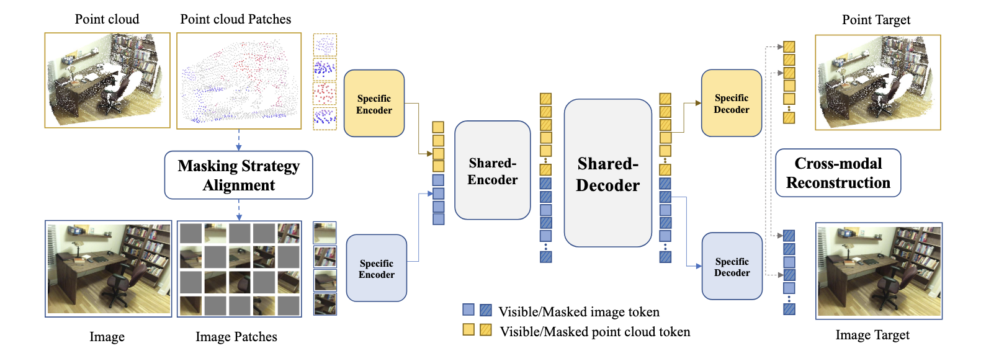

## [Med-2E3: A 2D-Enhanced 3D Medical Multimodal Large Language Model](https://arxiv.org/abs/2411.12783)

-  Inspiration: radiologists focus on both 3D spatial structure and
2D planar content, we propose Med-2E3, a novel MLLM
for 3D medical image analysis that integrates 3D and 2D
encoders. 

## [PiMAE: Point Cloud and Image Interactive Masked Autoencoders for 3D Object Detection](https://openaccess.thecvf.com/content/CVPR2023/papers/Chen_PiMAE_Point_Cloud_and_Image_Interactive_Masked_Autoencoders_for_3D_CVPR_2023_paper.pdf?utm_source=chatgpt.com)

Relavant:

- MAE architecture that processes two different data modalities (point cloud and RGB image dat); promotes feature extraction, alignment, and fusion across the modalities

Modality-Specific Encoders:

- These are separate encoders for each data modality (one for 2D images and another for 3D point clouds).

- They specialize in extracting features unique to each modality without mixing information at this stage.

- Each branch uses a Vision Transformer (ViT) backbone to encode its specific modality's data.

- Inputs:

    - Two types of data (e.g., 2D images and 3D point clouds) are represented as tokens.
    These tokens are augmented with positional embeddings (to encode spatial structure) and modality embeddings (to encode the source modality).

- Processing:

    - The tokens are passed through separate ViT-based encoders:
        $E_I:T_I→L_I$​: The image-specific encoder maps visible image patch tokens ($T_I$​) to a latent space ($L_I^1$​).
        $E_P:T_P→L_P^1$​: The point-specific encoder maps visible point cloud tokens ($T_P$​) to a latent space ($L_P^1$​).

- Output:

    - Each encoder produces a modality-specific latent representation ($L_I^1$​ for images and $L_P^1$​ for points).

Cross-Modal Encoder:

- After modality-specific feature extraction, the features are combined and refined using a shared encoder.

- This encoder promotes feature fusion and facilitates interactions between the different modalities.

- Inputs:

    - The latent representations ($L_I^1$​ and $L_P^1$​) from the modality-specific encoders.
    These representations align token information to ensure that shared patches across the two modalities contain related features.

- Processing:

    - A shared encoder ($E_S$​) is used to perform feature fusion and interaction:
        $E_S:(L_I^1,L_P^1)→L_S^2$​: Combines the two latent spaces into a fused latent space ($L_S^2$​).

- Alignment:

    - Alignment of masks ensures that corresponding tokens represent the same underlying features across both modalities, such as the same object or region in 2D and 3D views.

- Output:

    - The cross-modal latent space ($L_S^2$​) encodes fused and aligned features from both modalities.

## [Uni4Eye: Unified 2D and 3D Self-supervised Pre-training via Masked Image Modeling Transformer for Ophthalmic Image Classification](https://arxiv.org/pdf/2203.04614)

- Main:  Unified Patch Embedding (UPE) module

## [3D-EffiViTCaps: 3D Efficient Vision Transformer  with Capsule for Medical Image Segmentation](https://arxiv.org/abs/2403.16350)

- proposes 3D-EffiViTCaps, a 3D encoder-decoder network combining capsule networks and EfficientViT blocks to improve medical image segmentation by capturing both local and global features more efficiently
